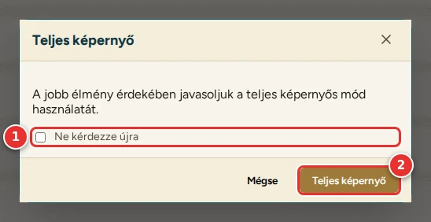
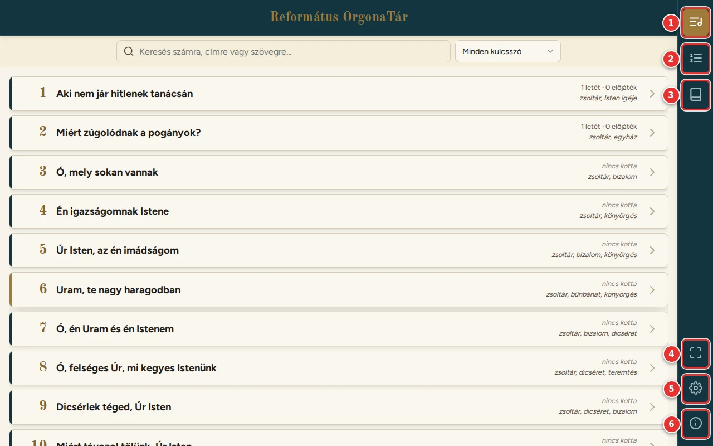
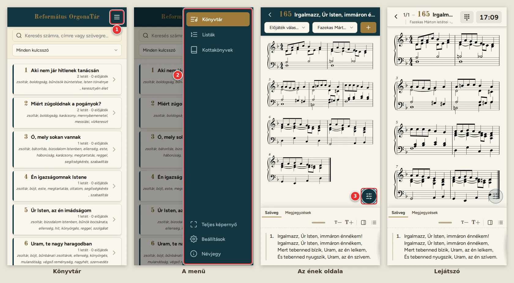

# Első lépések

[← Tartalom](README.md)

## Megnyitás

A program címe: <https://zseliakiraly.github.io/orgonatar/>. Böngészőben fut (Safari, Chrome, Edge, Firefox).
Az első megnyitáskor a program elmenti magát a készülékre, így később internet nélkül is elindul.

### A kezdőképernyőre téve (ajánlott)

Tableten és telefonon érdemes a programot a kezdőképernyőre tenni, így alkalmazásként, a böngésző sávjai nélkül indul.

- **iPad, iPhone (Safari):** Megosztás gomb → **Főképernyőhöz adás**.
- **Android (Chrome):** a ⋮ menü → **Hozzáadás a kezdőképernyőhöz** (vagy **Alkalmazás telepítése**).

iPaden és iPhone-on két dologra figyelj:
- A kezdőképernyőről indított program **külön tárolót** kap. Ott újra le kell tölteni a kottakönyveket, és a listák is
  külön vannak (a böngészőben készült listát [megosztással](07-megosztas.md) lehet átvinni).
- A Safari a weboldalak tárolt adatait (letöltött könyvek, listák, megjegyzések) **törölheti**, ha az oldalt kb. egy
  hétig nem nyitod meg. A kezdőképernyőre tett program ebből a szempontból is megbízhatóbb.

### Teljes képernyő

Ha a böngésző tudja, induláskor a program felajánlja a teljes képernyős módot.

1. **Ne kérdezze újra:** bejelölve a program többé nem kérdez rá.
2. **Teljes képernyő:** eltűnnek a böngésző sávjai. Később az oldalmenü Teljes képernyő gombjával is be- és
   kikapcsolható.

iPhone-on nincs teljes képernyős mód (ott a gomb sem látszik). A kezdőképernyőre tett program ott is a teljes
képernyőt kitölti.

## A felület részei

Az oldalmenü alapból a jobb szélen van, a [Beállításokban](08-beallitasok.md) balra is tehető. A gombjai:

1. **Könyvtár:** az énekeskönyv énekei, keresővel. Innen nyílik meg egy ének kottája és szövege.
2. **Listák:** az istentiszteletekre összeállított listák (énekrendek), és innen indul a lejátszó.
3. **Kottakönyvek:** a kottagyűjtemények letöltése a készülékre.
4. **Teljes képernyő:** be- és kikapcsolás (ha a böngésző tudja).
5. **Beállítások:** színséma, betűk, kottanézet. Újra megnyomva visszavisz oda, ahonnan jöttél.
6. **Névjegy:** a program adatai, link erre a **használati útmutatóra**, és a **Hiba bejelentése** gomb. A gomb a
   levelezőben új levelet nyit a <feedback@zseli.hu> címre, „OrgonaTár hibabejelentő” tárggyal. A levél végére a
   program a hiba kereséséhez hasznos adatokat ír (böngésző, ablakméret); a levél elejére írd le, mi történt.

A lapok bal felső sarkában lévő **‹** gomb az előző lapra visz vissza. Ugyanígy működik a böngésző és a telefon vissza
gombja is.

## Internet nélkül

A program és a **letöltött** kottakönyvek internet nélkül is működnek. Ha nem érhető el az internet (pl. a templomban
nincs térerő, vagy van WiFi, de nincs internet), néhány másodperc után a készüléken mentett változat indul. Részletek
a [Kottakönyveknél](02-kottakonyvek.md#internet-nélkül).

## Telefonon

Telefonon ugyanezek a lapok vannak, keskenyebb elrendezésben.

1. **Menügomb (☰):** álló telefonon az oldalmenü rejtve van, így a lapoknak több hely jut. A Könyvtár, a Listák, a
   Kottakönyvek, a Beállítások és a Névjegy tetején lévő gomb húzza elő. Az ének oldalán, a lista szerkesztőjében és a
   lejátszóban nincs menügomb: onnan a **‹** gombbal léphetsz vissza.
2. **A menü:** ugyanazok a gombok, mint az oldalmenüben, a nevükkel. Azon az oldalon jön elő, ahol az oldalmenü lenne
   (lásd: [Beállítások](08-beallitasok.md)). Egy pontjára vagy mellé koppintva bezárul.
3. Az ének oldalán a választók a cím alá kerülnek; a kotta alatt a [csillagok](03-konyvtar.md#a-letétek-értékelése), a
   nagyítás és a letét adatai egymás mellett vannak.

A lejátszóban a letét adatai a cím alatti sorba, a szövegpanel fülei külön sorba kerülnek. Fekvő telefonon az
oldalmenü a megszokott helyén van.

---

[Tovább: Kottakönyvek →](02-kottakonyvek.md)
