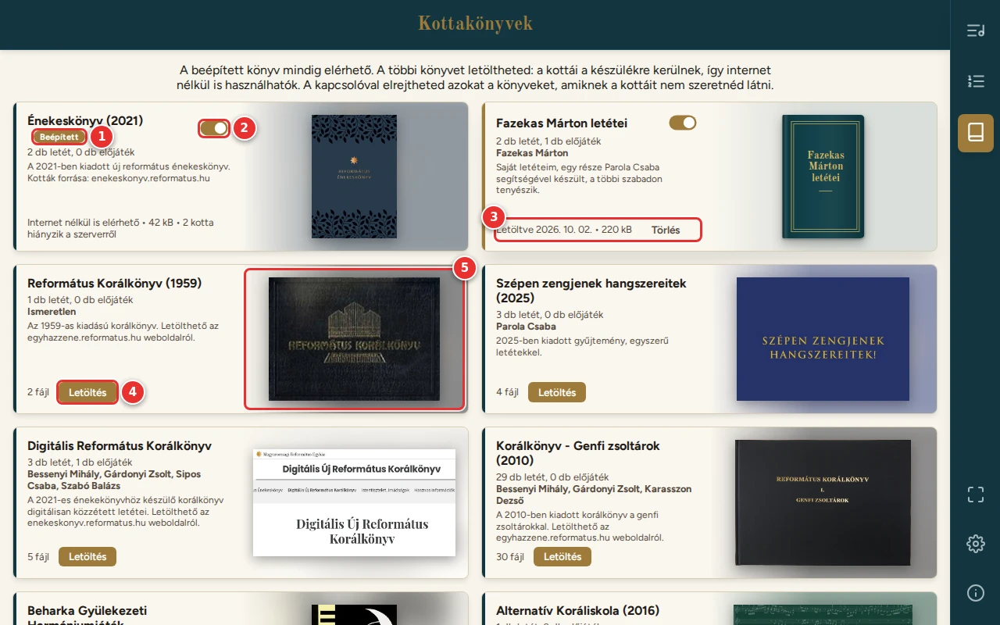

# Kottakönyvek

[← Tartalom](README.md)

A kották kottakönyvekben vannak. Egy könyv egy gyűjtemény, pl. egy korálkönyv vagy egy szerző letétei. A Könyvtárban és
a lejátszóban csak a **letöltött** (és bekapcsolt) könyvek kottái jelennek meg, ezért először itt töltsd le, amire
szükséged van.

1. **Beépített könyv:** mindig elérhető, és magától a készülékre mentődik, le sem kell tölteni.
2. **Kapcsoló:** elrejti a könyv kottáit. Akkor hasznos, ha egy könyvből nem szeretnél választani. A könyv a készüléken
   marad, és visszakapcsolva a kottái újra megjelennek. Az elrejtett könyv kártyája halvány.
3. **Letöltött könyv:**
   - a kártyán a letöltés napja és a mérete látszik;
   - a **Törlés** gombbal eltávolítható a készülékről (a program előtte megerősítést kér).
4. **Letöltés:** a könyv kottái és a borítóképe a készülékre kerülnek.
   - Letöltés közben a kártya mutatja, hány fájl van már meg.
   - A **Mégse** megszakítja a letöltést.
5. **Borító:** a könyv borítóképe. Ahol nincs kép, a program a könyv címéből rajzol egyet.

Nagyobb kijelzőn a kártyák két-három oszlopban állnak, telefonon egymás alatt. Telefonon a borító kis kép a kártya jobb
felső sarkában.

## Frissítés

Ha egy letöltött könyvbe új kották kerülnek a szerveren, a kártyán megjelenik az **Új kották érhetők el** felirat és a
**Frissítés** gomb. Frissítéskor csak az új és a megváltozott fájlok töltődnek le. A beépített könyv magától frissül.

Ha a kártyán **„N kotta hiányzik a szerverről”** áll, a könyv néhány kottafájlja még nincs fent a szerveren. A többi
kotta ettől használható. Ha a hiányzók később felkerülnek, a program a következő megnyitáskor magától letölti őket.

## Internet nélkül

- A letöltött könyvek kottái és maga a program internet nélkül is működnek.
- Internet nélkül:
  - az oldal tetején figyelmeztetés jelzi, hogy nincs kapcsolat;
  - a le nem töltött könyvek kártyáján „Nem érhető el: nincs internetkapcsolat” áll.
- Érdemes az istentisztelet előtt interneten megnyitni a programot. Ilyenkor a beépített könyv magától frissül, a
  többinél pedig a kártya jelzi, ha frissítés érhető el.
- Letölteni csak akkor lehet, ha a programot a megszokott, `https://` kezdetű címén nyitod meg. Ha helyi hálózaton,
  IP-címmel nyitod meg, nincs letöltés: ilyenkor minden kotta internettel, a szerverről jön.

---

[← Első lépések](01-elso-lepesek.md) · [Tovább: Könyvtár és az ének oldala →](03-konyvtar.md)
