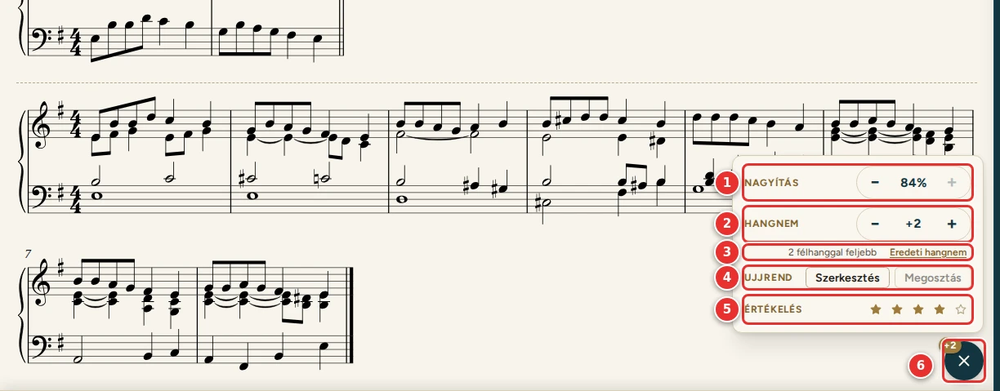

# Könyvtár és az ének oldala

[← Tartalom](README.md)

## Könyvtár

A Könyvtár az énekeskönyv összes énekét mutatja, énekszám szerint.

1. **Kereső:**
   - keres énekszámra, a kezdősorra, az ének szövegének egy részére (pl. `42`, `híves patak`) és a kulcsszavakra is;
   - az **Enter** megnyitja az első találatot;
   - a mező jobb szélén az **X** (vagy az Escape) törli a keresést.
2. **Kulcsszó:** csak az adott témájú énekek látszanak (pl. advent, karácsony, úrvacsora).
3. **Ének:** énekszám és kezdősor. Koppintásra megnyílik az ének oldala.
4. **Letétek és előjátékok száma** a letöltött, bekapcsolt könyvekből. Ha egy sincs: „nincs kotta”.
5. Az ének **kulcsszavai**. Egy kulcsszóra koppintva arra szűr, újra koppintva a szűrés megszűnik.

A szűrő menüjében (1) a kulcsszavak mellett az énekek száma látszik. A szűrő a keresővel együtt is használható.

## Az ének oldala

1. **Vissza** a Könyvtárba.
2. **Énekszám és cím.**
3. **Előjáték:** ha van az énekhez előjáték, itt választható ki. A kotta fölött jelenik meg.
4. **Változat (letét):** ha egy énekhez több letét is van, akár több könyvből, itt lehet váltani közöttük. A legjobbra
   értékelt letét áll elöl (lásd lent).
5. **Hozzáadás listához (+):** az ének a választott letéttel és előjátékkal egy listára kerül (lásd:
   [Listák](05-listak.md#énekek-hozzáadása)).
6. Az **előjáték** a letét fölött, a nevével.
7. **A kotta beállításai:** a jobb alsó sarokban lebegő kerek gomb. A panelje a nagyítás, a hangnem (transzponálás), az
   ujjrend és az értékelés (lásd lent: [A kotta beállításai](#a-kotta-beállításai)). A kotta alatt így nincs külön sáv, a kotta
   a terület aljáig érhet.
8. **Szövegpanel:** az ének versszakai (lásd: [Szövegpanel](04-szovegpanel.md)).

**A kottát nem kell görgetni.** A program úgy választja meg a méretét és a sortöréseket, hogy az előjáték és a letét
együtt, egészben elférjen.
- Ha a nagyítás **+** gombja nem nyomható, a kotta nagyobban már nem férne ki.
- A tablet elforgatásakor és a szövegpanel áthelyezésekor a kotta újra igazodik.

Ha az énekhez nincs elérhető kotta, a „Nincs elérhető kotta” felirat látszik. Ilyenkor a
[Kottakönyvek](02-kottakonyvek.md) oldalon tölthetsz le hozzá könyvet.

## A kotta beállításai

A jobb alsó sarokban lebegő kerek gombra koppintva nyílik a panel. Újra a gombra (ekkor ✕), az Esc billentyűvel vagy
mellé koppintva bezárul.

1. **Nagyítás:**
   - a − és a + 10%-onként állítja a kotta legnagyobb méretét;
   - a felirat a ténylegesen látott méretet mutatja.
2. **Hangnem:** a − és a + egy félhanggal lejjebb vagy feljebb viszi a kottát, legfeljebb 6 félhanggal. Az előjáték és
   a letét együtt változik; a képen 2 félhanggal feljebb, F-dúrból G-dúrba.
3. Hány félhanggal változott. Az **Eredeti hangnem** gomb visszaállítja.
4. **Értékelés:** a látott letét csillagai (lásd lent: [A letétek értékelése](#a-letétek-értékelése)).
5. A gomb. Ha a kotta transzponálva van, a gombon zárt panelnél is látszik, mennyivel (pl. **+2**).

A Hangnem alatt az **Ujjrend** sora: **Szerkesztés** és **Megosztás** (lásd lent: [Ujjrend](#ujjrend)). (A képen ez a
sor még nem látszik.)

**A transzponálásról:**
- Az **énekhez** tárolódik, csak ezen a készüléken: az ének minden letétjére és előjátékára érvényes, legközelebb is
  így nyílik meg, és a lejátszóban is.
- A program a legkevesebb előjegyzésű hangnemet választja. Például C-dúrból egy félhanggal feljebb Desz-dúr lesz
  (5 bé), nem Cisz-dúr (7 kereszt).
- A **képként** tárolt kotta (beszkennelt oldal) nem transzponálható: a Hangnem gombjai ilyenkor nem nyomhatók.

## Ujjrend

A hangok fölé és alá ujjrendet (1–5) írhatsz. A számok a kottába kerülnek, nem rá vannak ragasztva. Ezért nagyításkor
a kottával együtt nőnek és kisebbednek, és a sortörés változásakor is a hangjukkal maradnak.

**Beírás:**
1. A kotta beállításainak panelén, az **Ujjrend** sorában: **Szerkesztés**. A kotta fölött megjelenik egy sáv:
   „Ujjrend: koppints egy hangra”.
2. Koppints egy hangra. A hang kiemelődik, és mellette megjelenik egy kis billentyűzet:
   - **1–5:** az ujj;
   - **–:** ujjcsere (pl. `4–3`);
   - **⌫:** az utolsó jel törlése.
3. **OK** (vagy egy másik hangra koppintás): a szám a kottába kerül. **Törlés:** a hang száma törlődik.
4. Ha végeztél, a sávon vagy a panelen: **Kész**.

**Billentyűzettel:** az 1–5, a kötőjel (ujjcsere) és a Backspace írja a számot. Az Enter elmenti, a Delete törli, az
Esc elveti.

**Tudnivalók:**
- **Hol jelenik meg a szám?** A felső sor (jobb kéz) számai a vonalrendszer fölött, a többi sor (bal kéz, pedál)
  számai alatta vannak, a vonalaktól távolabb, mint a hangok.
- **Akkordok:** az egyszerre szóló hangok számai egymás fölé kerülnek. Felül mindig a legmagasabb hangé áll.
- **Közös hang:** ha két szólam ugyanazt a hangot játssza, a hangfejek fedik egymást. Az első koppintás a felső szólam
  hangját választja, egy újabb koppintás a másikét. A kiemelt szár mutatja, melyik szólam hangja van kiválasztva.
- **Meglévő szám:** ha egy hangnak már van száma, a billentyűzeten kijelölve látszik, és az első gombnyomás felülírja.
- **Hangnemenként külön:** minden letétnek és előjátéknak 12 ujjrendje lehet, félhangonként egy. Transzponáláskor a
  program az adott hangnem ujjrendjét mutatja. A 6 félhanggal feljebb és a 6 félhanggal lejjebb transzponált kotta
  ugyanaz a hangnem, ezért az ujjrendjük is közös. Szerkesztés közben a sávon látszik, melyik hangnemben vagy
  (pl. „Ujjrend (+2)”).
- **Hol tárolódik?** Csak ezen a készüléken. Máshová a **Megosztás** gombbal küldheted át (lásd:
  [Megosztás és importálás](07-megosztas.md#ujjrend-megosztása)), az összeset pedig fájlba mentheted (lásd:
  [Beállítások](08-beallitasok.md#4-adatok-mentése-és-megosztása)).
- Szerkesztés közben a kotta szélére koppintva és a lapozópedállal sem lapoz a program, amíg a billentyűzet nyitva
  van.
- **Képként** tárolt kottába (beszkennelt oldal) nem írható ujjrend: ilyenkor a panelen nincs Ujjrend sor.

## A letétek értékelése

Ha egy énekhez több letét is van, csillagokkal (1–5) megjelölheted, melyiket szereted a legjobban. Az ének oldalán a
[kotta beállításainak](#a-kotta-beállításai) panelén lévő csillagok a **látott** letétre vonatkoznak.
- Egy csillagra koppintva annyi csillagot kap a letét. Ugyanarra a csillagra újra koppintva az értékelés törlődik.
- Az értékelés **csak ezen a készüléken** tárolódik, a listákhoz hasonlóan.
- A lejátszóban a panelen nincs értékelés, csak nagyítás és hangnem: az istentisztelet alatt egy véletlen koppintás
  ne értékeljen.

1. A választóban a **legjobbra értékelt** letét áll elöl, utána a többi az értékelése szerint.
2. Az értékelt letét mellett a **csillagai** látszanak.
3. Az értékelés nélküli letétek a könyvek sorrendjében következnek, de a **beépített énekeskönyv** kottája a végére
   kerül (kivéve, ha jobbra értékelted). Egyforma értékelésnél is a beépített könyv kottája kerül hátrébb.

Az ének megnyitásakor mindig a választó első letétje jelenik meg, vagyis a legjobbra értékelt. Ha egyik sincs
értékelve, az első, amelyik nem a beépített énekeskönyvből való. Ugyanez a letét kerül a listára, ha a lista
szerkesztőjéből adod hozzá az éneket ([Listák](05-listak.md#énekek-hozzáadása)).

---

[← Kottakönyvek](02-kottakonyvek.md) · [Tovább: Szövegpanel →](04-szovegpanel.md)
