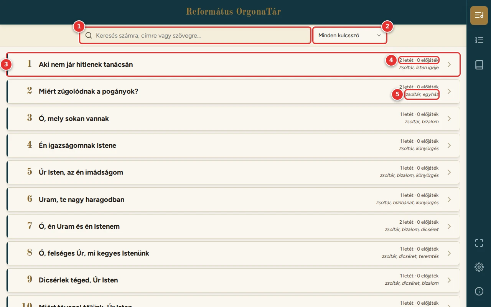
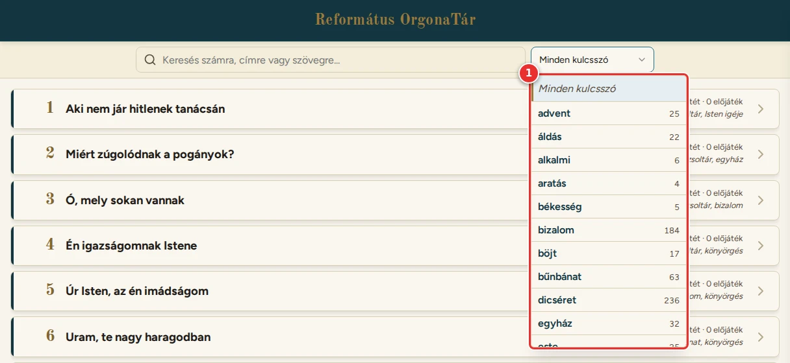
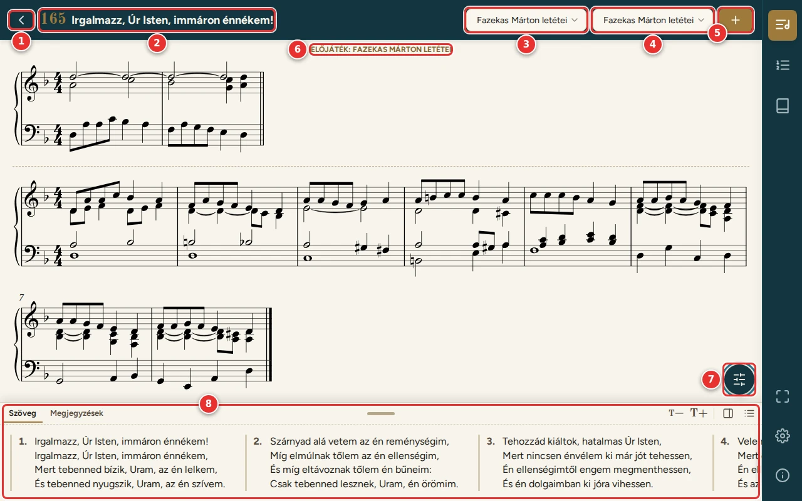
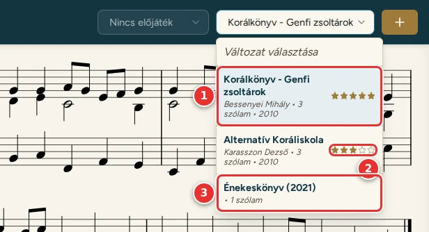

# Könyvtár és az ének oldala

[← Tartalom](README.md)

## Könyvtár

A Könyvtár az énekeskönyv összes énekét mutatja, énekszám szerint.

1. **Kereső:**
   - keres énekszámra, a kezdősorra, az ének szövegének egy részére (pl. `42`, `híves patak`) és a kulcsszavakra is;
   - az **Enter** megnyitja az első találatot;
   - a mező jobb szélén az **X** (vagy az Escape) törli a keresést.
2. **Kulcsszó:** csak az adott témájú énekek látszanak (pl. advent, karácsony, úrvacsora).
3. **Ének:** énekszám és kezdősor. Koppintásra megnyílik az ének oldala.
4. **Letétek és előjátékok száma** a letöltött, bekapcsolt könyvekből. Ha egy sincs: „nincs kotta”.
5. Az ének **kulcsszavai**. Egy kulcsszóra koppintva arra szűr, újra koppintva a szűrés megszűnik.

A szűrő menüjében (1) a kulcsszavak mellett az énekek száma látszik. A szűrő a keresővel együtt is használható.

## Az ének oldala

1. **Vissza** a Könyvtárba.
2. **Énekszám és cím.**
3. **Előjáték:** ha van az énekhez előjáték, itt választható ki. A kotta fölött jelenik meg.
4. **Változat (letét):** ha egy énekhez több letét is van, akár több könyvből, itt lehet váltani közöttük. A legjobbra
   értékelt letét áll elöl (lásd lent).
5. **Hozzáadás listához (+):** az ének a választott letéttel és előjátékkal egy listára kerül (lásd:
   [Listák](05-listak.md#énekek-hozzáadása)).
6. Az **előjáték** a letét fölött, a nevével.
7. **Értékelés:** a látott letét csillagai (lásd lent: [A letétek értékelése](#a-letétek-értékelése)).
8. **Nagyítás:**
   - a − és a + 10%-onként állítja a kotta legnagyobb méretét;
   - a felirat a ténylegesen látott méretet mutatja.
9. A letét **adatai:** év, szólamok száma.
10. **Szövegpanel:** az ének versszakai (lásd: [Szövegpanel](04-szovegpanel.md)).

**A kottát nem kell görgetni.** A program úgy választja meg a méretét és a sortöréseket, hogy az előjáték és a letét
együtt, egészben elférjen.
- Ha a **+** nem nyomható, a kotta nagyobban már nem férne ki.
- A tablet elforgatásakor és a szövegpanel áthelyezésekor a kotta újra igazodik.

Ha az énekhez nincs elérhető kotta, a „Nincs elérhető kotta” felirat látszik. Ilyenkor a
[Kottakönyvek](02-kottakonyvek.md) oldalon tölthetsz le hozzá könyvet.

## A letétek értékelése

Ha egy énekhez több letét is van, csillagokkal (1–5) megjelölheted, melyiket szereted a legjobban. Az ének oldalán a
kotta alatt, balra lévő csillagok a **látott** letétre vonatkoznak.
- Egy csillagra koppintva annyi csillagot kap a letét. Ugyanarra a csillagra újra koppintva az értékelés törlődik.
- Az értékelés **csak ezen a készüléken** tárolódik, a listákhoz hasonlóan.
- A lejátszóban nincs csillag: ott a kotta alsó sarkára koppintva is lapozni lehet, és egy véletlen koppintás ne
  értékeljen.

1. A választóban a **legjobbra értékelt** letét áll elöl, utána a többi az értékelése szerint.
2. Az értékelt letét mellett a **csillagai** látszanak.
3. Az értékelés nélküli letétek a könyvek sorrendjében következnek, de a **beépített énekeskönyv** kottája a végére
   kerül (kivéve, ha jobbra értékelted). Egyforma értékelésnél is a beépített könyv kottája kerül hátrébb.

Az ének megnyitásakor mindig a választó első letétje jelenik meg, vagyis a legjobbra értékelt. Ha egyik sincs
értékelve, az első, amelyik nem a beépített énekeskönyvből való. Ugyanez a letét kerül a listára, ha a lista
szerkesztőjéből adod hozzá az éneket ([Listák](05-listak.md#énekek-hozzáadása)).

---

[← Kottakönyvek](02-kottakonyvek.md) · [Tovább: Szövegpanel →](04-szovegpanel.md)
