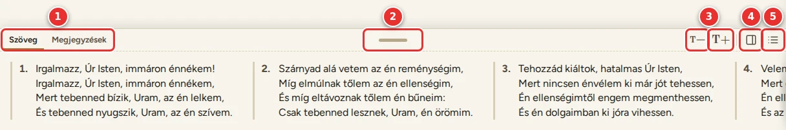
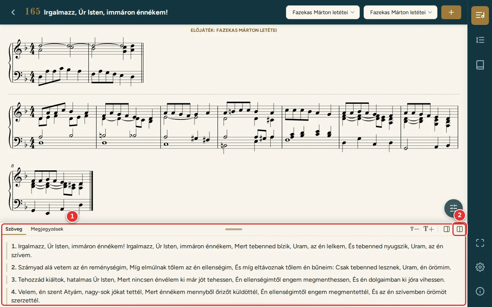
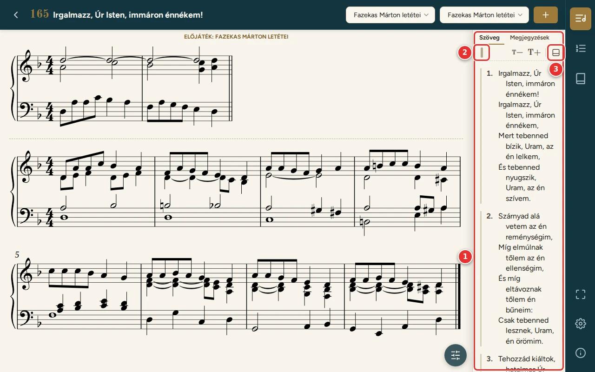
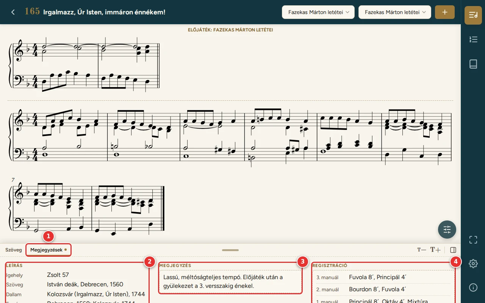
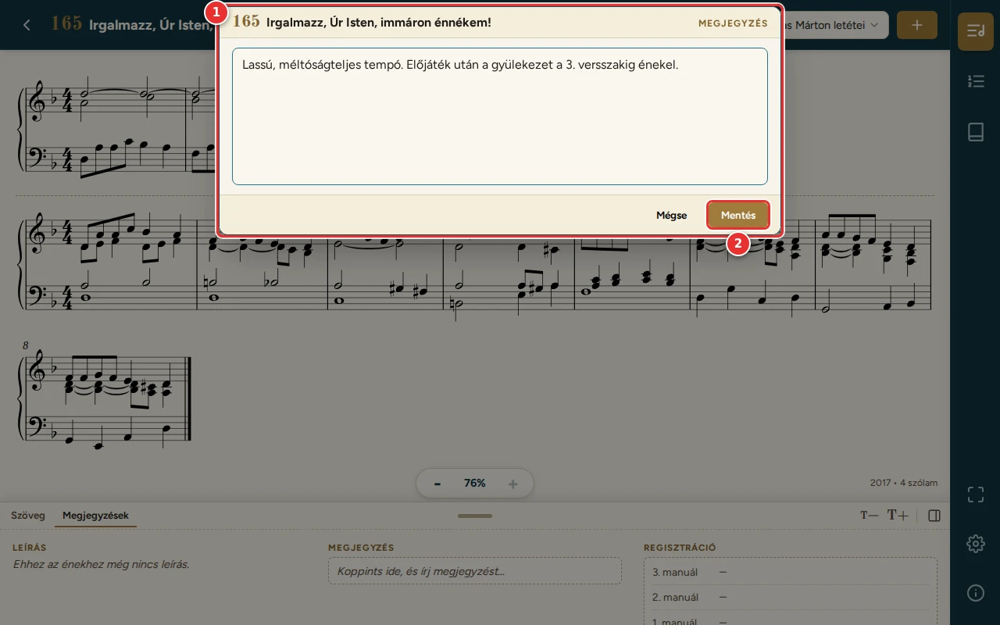

# Szövegpanel, megjegyzés, regisztráció

[← Tartalom](README.md)

A szövegpanel az ének versszakait mutatja a kotta alatt vagy mellett, a Könyvtárban és a lejátszóban is. Két lapja
van: **Szöveg** és **Megjegyzések**.

## Az eszköztár

1. **Fülek:** a Szöveg és a Megjegyzések lap. A választott fül a program futása alatt minden éneknél ugyanaz marad,
   pl. a lejátszóban lapozva is. Újraindításkor a Szöveg lap jelenik meg.
2. **Fogantyú:** húzással (egérrel vagy ujjal) átméretezi a panelt. Dupla koppintás a fogantyún: vissza az
   alapméretre.
3. **T− / T+:** kisebb, nagyobb betű (80–200%).
4. **Oldalra tesz / Lentre tesz:** a panel a kotta mellé vagy alá kerül.
5. **Folyó szöveg / Oszlopos nézet:** lent kétféle elrendezés van (lásd lent).

A panel helyét, nézetét, méretét és betűméretét a program **énekenként megjegyzi**. Legközelebb – a Könyvtárban és a
lejátszóban is – ugyanígy jelenik meg. Amit egy énekhez még nem állítottál be, az alapértelmezés szerint látszik.

A szövegpanel a [Beállításokban](08-beallitasok.md) („Szövegpanel megjelenítése”) teljesen el is rejthető.

## Elrendezések

**Lent, oszlopokban** (alapértelmezett, lásd a fenti képet):
- a versszakok egymás mellett állnak, a sorok egymás alatt, törés nélkül;
- ha nem fér ki minden versszak, a panel oldalra görgethető;
- a refrén külön oszlopban, dőlt betűvel áll az első versszak mellett.

**Lent, folyó szövegként:** a versszakok egymás alatt, a soraik egymás után. A panel legfeljebb a kottanézet 30%-át
foglalja el, a többi versszak görgethető.

1. A szövegpanel folyó szövegként.
2. **Oszlopos nézet:** vissza az oszlopokhoz.

**Oldalt:**

1. A versszakok egymás alatt; a hosszú sor behúzással folytatódik a következő sorban.
2. **Fogantyú:** oldalt vízszintesen méretez (alapméret: a kottanézet 15%-a, legalább 200 képpont).
3. **Lentre tesz:** vissza a kotta alá.

Ha a panelen jobbra vagy lejjebb még van szöveg, a szélén árnyék jelzi.

## Megjegyzések lap

1. **Megjegyzések fül.** A pötty jelzi, ha az énekhez van megjegyzés vagy regisztráció.
2. **Leírás:** az ének himnológiai leírása (szöveg, dallam, forrás). Csak olvasható, a program adataiból jön; ahol még
   nincs, „Ehhez az énekhez még nincs leírás.” áll.
3. **Megjegyzés:** saját jegyzet az énekhez, pl. tempó, az előjáték hossza. Koppintásra szerkeszthető.
4. **Regisztráció:** négy mező (3. manuál, 2. manuál, 1. manuál, Pedál). Egy sorra koppintva szerkeszthető.

Lent a három rész egymás mellett áll, oldalt egymás alatt. A T− / T+ ennek a lapnak a betűméretét is állítja.

### Szerkesztés

1. A szerkesztő a képernyő **tetején** nyílik meg, így tableten és telefonon a képernyő-billentyűzet nem takarja el.
2. **Mentés:** a gombbal, Ctrl+Enterrel, vagy a háttérre koppintva. A **Mégse** vagy az Escape elveti a változást.

A regisztrációnál a megérintett sor kapja a kurzort. Az Enter a következő mezőre lép, az utolsóban ment.

A megjegyzés és a regisztráció énekenként, **csak ezen a készüléken** tárolódik. A lejátszóban is az adott énekhez
tartozó jelenik meg. Szerkesztés közben a lapozópedál nem lapoz.

---

[← Könyvtár és az ének oldala](03-konyvtar.md) · [Tovább: Listák →](05-listak.md)
