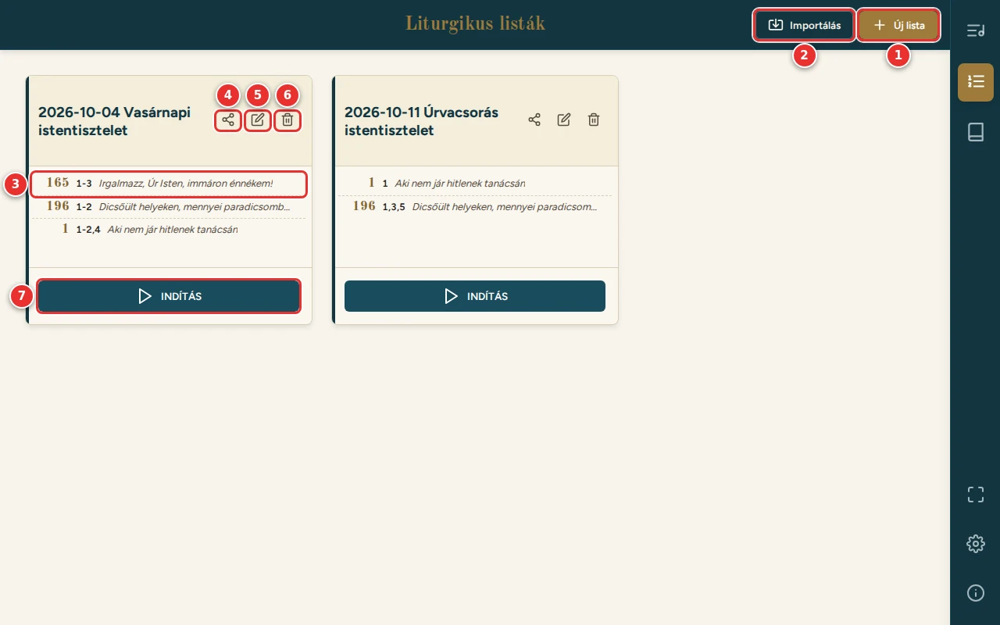
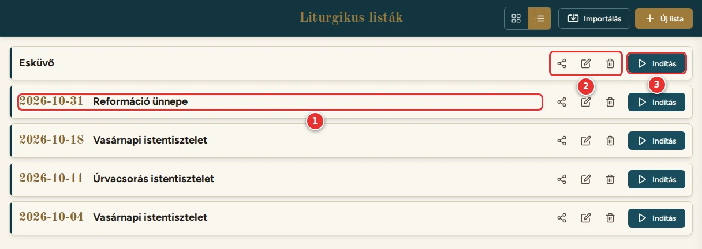
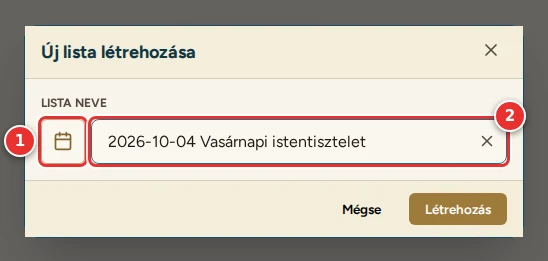
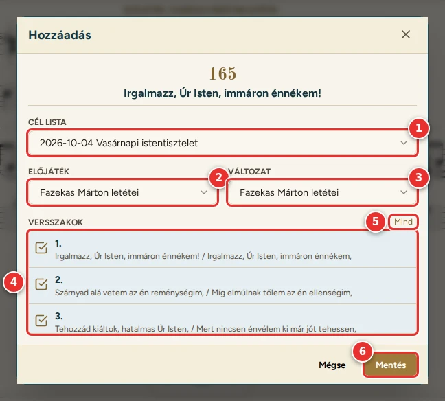
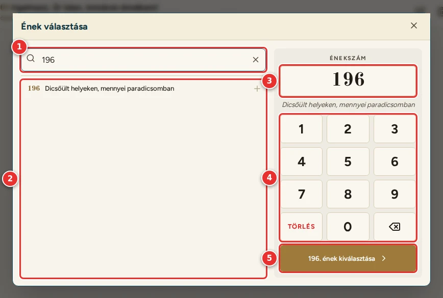
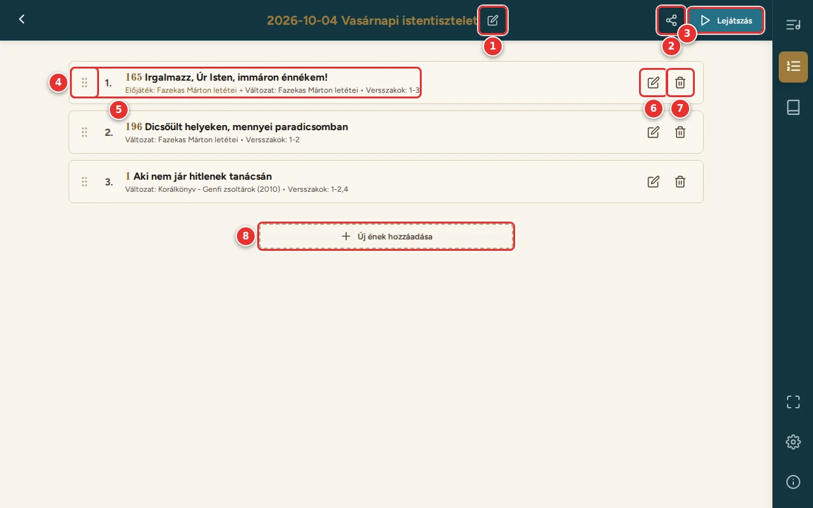

# Listák

[← Tartalom](README.md)

A lista egy istentisztelet énekrendje: az énekek sorrendben, mindegyik a választott letéttel, előjátékkal és
versszakokkal. A listák **ezen a készüléken** tárolódnak. Másik eszközre a [megosztással](07-megosztas.md) vihetők át.

## A Listák oldal

A listák közül mindig a **legújabb** áll elöl (amelyiket utoljára hoztad létre vagy importáltad).

1. **Nézet:** csempék (alapértelmezett) vagy lista (lásd lent: [Listás nézet](#listás-nézet)). A választott nézet
   ezen a készüléken megmarad.
2. **Importálás:** lista beolvasása kódból, linkből, fájlból vagy QR-kódról (lásd: [Megosztás és
   importálás](07-megosztas.md)).
3. **Új lista:** új, üres lista (lásd lent).
4. **A lista énekei:** énekszám, a kiválasztott versszakok (pl. `1-3`, `1,3,5`) és a kezdősor.
5. **Megosztás:** a lista kódja és QR-kódja.
6. **Szerkesztés:** megnyitja a lista szerkesztőjét. A kártyára koppintva is megnyílik.
7. **Törlés:** a lista törlése (a program előtte megerősítést kér).
8. **Indítás:** a lista megnyitása a [lejátszóban](06-lejatszo.md).

### Listás nézet

Sok lista esetén áttekinthetőbb: soronként egy lista, az énekei nélkül, a Könyvtár énekkártyáihoz hasonlóan.

1. **A lista neve.** Ha a név dátummal kezdődik (a naptár gombbal), a dátum talpas betűvel, külön látszik.
2. **Megosztás, Szerkesztés, Törlés:** ugyanaz, mint a csempén.
3. **Indítás:** a lista megnyitása a lejátszóban, a többi gombbal egy sorban. Telefonon csak a ▶ ikon látszik.

A sorra koppintva a lista szerkesztője nyílik meg.

## Új lista

1. **Naptár gomb:**
   - a választott dátum (ÉÉÉÉ-HH-NN, pl. a szertartás napja) a név elejére kerül;
   - újabb dátum választásakor csak a név elején álló dátum cserélődik, a név többi része marad.
2. **A lista neve:** a dátum után tovább írható, pl. `2026-10-04 Vasárnapi istentisztelet`.

A **Létrehozás** gombbal (vagy Enterrel) a lista megjelenik a Listák oldalon.

## Énekek hozzáadása

Két helyről lehet énekeket a listára tenni.

**Az ének oldaláról:** a Könyvtárban nyisd meg az éneket, válaszd ki a letétet és az előjátékot, majd nyomd meg a
**+** gombot.

1. **Cél lista:** melyik listára kerüljön az ének. Alapból a legújabb lista van kiválasztva, a választóban is ez áll
   elöl. Az **+ Új lista…** sorral itt is létrehozható új lista, a naptár gombbal együtt.
2. **Előjáték:** az ének oldalán választott előjáték, itt módosítható. A „Nincs kiválasztva” sorral elhagyható.
3. **Változat:** a letét. Az ének oldaláról az ott látott letét, a lista szerkesztőjéből a legjobbra értékelt (lásd:
   [A letétek értékelése](03-konyvtar.md#a-letétek-értékelése)). A választóban az értékelt letétek mellett a
   csillagaik is látszanak.
4. **Versszakok:** a kiválasztottak jelennek meg a lejátszó szövegpaneljén. Alapból mind ki van jelölve, egy sorra
   koppintva ki-be kapcsolható.
5. **Mind / Egyik sem:** az összes versszak kijelölése vagy törlése.
6. **Mentés:** az ének a lista végére kerül.

**A lista szerkesztőjéből:** az **Új ének hozzáadása** gomb megnyitja az énekválasztót.

1. **Kereső:** szövegre is lehet keresni. Tableten nem kap magától fókuszt, így nem ugrik fel a képernyő-billentyűzet.
2. **Találatok:** koppintásra kiválasztja az éneket.
3. **A beírt énekszám** és alatta az ének kezdősora (vagy: „Nincs ilyen számú ének”).
4. **Számbillentyűzet:** a **Törlés** törli a beírt számot, a **⌫** az utolsó számjegyet.
5. A **kiválasztás** gombja. Utána a Hozzáadás ablak nyílik meg, már cél lista nélkül (az ének erre a listára kerül).

Fizikai billentyűzeten is működik: számok, Backspace, Enter, Escape.

## A lista szerkesztője

1. **Átnevezés:** a név melletti ceruzával. A naptár gomb itt is működik.
2. **Megosztás:** lásd: [Megosztás és importálás](07-megosztas.md).
3. **Lejátszás:** a lista megnyitása a lejátszóban.
4. **Fogantyú:** az ének húzással áthelyezhető a listában.
   - Egérrel bárhol megfogható.
   - Érintéssel a fogantyúnál kell megfogni, máshol a lista görgethető.
   - Húzás közben a többi ének félrehúzódik; a képernyő széléhez érve a lista magától görget.
5. **Az ének sora:** a választott előjáték, letét és versszakok. Koppintásra megnyílik az **Ének szerkesztése** ablak.
6. **Ének szerkesztése** (ceruza): ugyanaz az ablak. Itt utólag módosítható a letét, az előjáték és a versszakok.
7. **Törlés** (kuka): az ének eltávolítása a listáról (a program előtte megerősítést kér).
8. **Új ének hozzáadása:** az énekválasztó (lásd fent).

Ha egy éneknél a választott letét vagy előjáték ezen az eszközön nem érhető el, az Ének szerkesztése ablak jelzi.
(Ez pl. egy importált listánál fordul elő, ha a könyve nincs letöltve.) A választás ilyenkor megmarad, amíg mást nem
választasz. Az előjáték az **Előjáték nélkül** gombbal elhagyható.

---

[← Szövegpanel](04-szovegpanel.md) · [Tovább: Lejátszó →](06-lejatszo.md)
