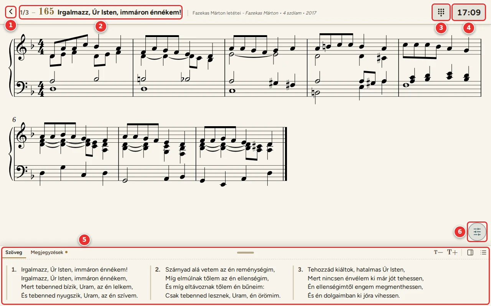
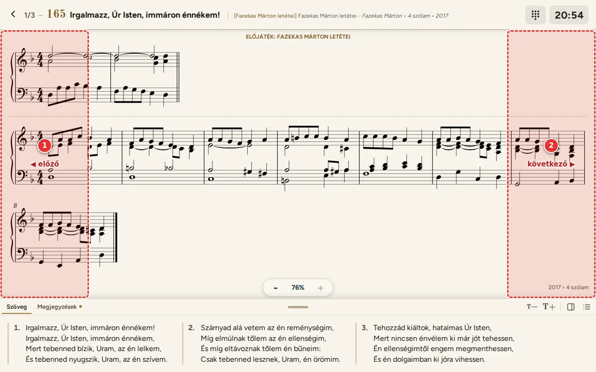
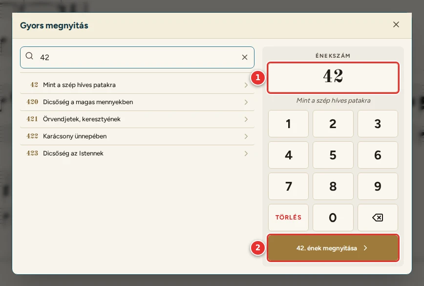

# Lejátszó

[← Tartalom](README.md)

A lejátszó az istentiszteletre készült. A lista énekei egymás után jelennek meg, a teljes képernyőn, oldalmenü
nélkül; az énekek között lapozni lehet. Indítás:
- a Listák oldalon a lista **Indítás** gombjával, vagy
- a lista szerkesztőjében a **Lejátszás** gombbal.

1. **Vissza:** kilépés a lejátszóból, oda, ahonnan indítottad.
2. **Fejléc:**
   - hányadik ének a listában (pl. `1/3`), az énekszám és a cím;
   - utána az előjáték (szögletes zárójelben) és a letét adatai: könyv, szerző, szólamok, év.
3. **Gyors megnyitás:** egy énekszám beírásával bármelyik ének megnyitható (lásd lent).
4. **Óra:** a pontos idő. A [Beállításokban](08-beallitasok.md) kikapcsolható.
5. **Szövegpanel:** csak a listán kiválasztott versszakok. A Megjegyzések lapon az ének megjegyzése és regisztrációja
   (lásd: [Szövegpanel](04-szovegpanel.md)).

A kotta itt is mindig egészben látszik: a program akkorára méretezi, hogy görgetés nélkül elférjen.

## Lapozás

1. Koppintás a kottaterület **bal szélére** (a szélső 15%-ra): az előző ének.
2. Koppintás a kottaterület **jobb szélére**: a következő ének.

Egérrel a két sáv fölött nyíl alakú kurzor jelzi, merre lapoz.

**Billentyűzettel vagy Bluetooth-os lapozópedállal:**
- előre: PageDown, ↓ vagy →;
- hátra: PageUp, ↑ vagy ←.

Mindig egész éneket lapoz. A lenyomva tartott billentyű (pedál) csak egyet lapoz.

## Gyors megnyitás

Ha az istentisztelet alatt egy listán nem szereplő ének kell (pl. a lelkész kér egy másikat), nyomd meg a gyors
megnyitás gombot (3).

1. A számbillentyűzeten beírt **énekszám**, alatta az ének kezdősora.
2. **Megnyitás:** az ének oldala nyílik meg. Innen a vissza gomb ugyanoda visz vissza a lejátszóba, ahol voltál.

A bal oldali keresővel szöveg alapján is lehet keresni. Fizikai billentyűzeten a számok, a Backspace, az Enter és az
Escape is működik.

---

[← Listák](05-listak.md) · [Tovább: Megosztás és importálás →](07-megosztas.md)
