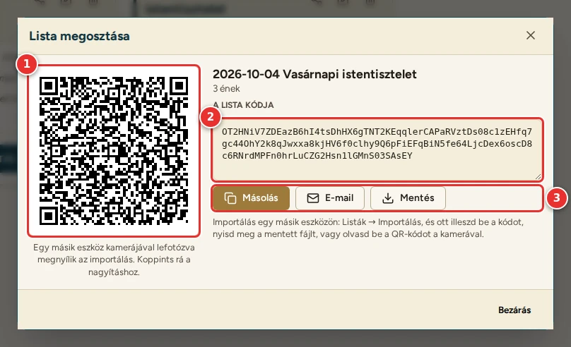
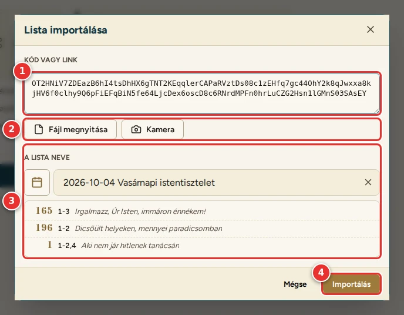

# Megosztás és importálás

[← Tartalom](README.md)

A listák a készüléken tárolódnak. Másik tabletre, telefonra vagy egy kollégának a lista **kódjával** küldhetők át. A
kód egyetlen betűkből és számokból álló karakterlánc, amely a lista nevét és az énekeket tartalmazza.

## Megosztás

A Listák oldalon a lista kártyáján, vagy a lista szerkesztőjének fejlécében: **Megosztás**.

1. **QR-kód:** egy másik eszköz kamerájával lefotózva megnyílik a program, az importálással.
   - Koppintásra a QR-kód kitölti a képernyőt, így hosszú listánál is biztosan beolvasható.
   - Újabb koppintás vagy az Escape bezárja.
2. **A lista kódja:** pl. `OT2HNiV7ZDEazB6hI4ts…`. Koppintásra kijelölődik.
3. **Gombok:**
   - **Másolás:** a kód a vágólapra kerül, és bárhová beilleszthető (üzenet, e-mail).
   - **E-mail:** a levelezőben új levél nyílik a lista énekeivel (versszakokkal) és a megnyitó linkkel.
   - **Mentés:** szövegfájl (`<a lista neve>.txt`) a listával, a linkkel és a kóddal.
   - **Küldés…** (telefonon, tableten): küldés más alkalmazással, pl. üzenetben.

## Importálás

A Listák oldalon: **Importálás**.

1. **Kód vagy link:** ide illeszd be a kódot vagy a megosztási linket. Akkor is felismeri, ha egy hosszabb szöveg
   (pl. egy e-mail) közepén van, vagy több sorra tördelődött.
2. **Fájl megnyitása:** a mentett `.txt` fájl, vagy a QR-kódról készült fénykép, képernyőkép.
   **Kamera:** a hátlapi kamerával beolvassa a QR-kódot (ehhez engedélyezni kell a kamerát).
3. **Előnézet:** a lista neve (átírható, a naptár gombbal is) és az énekei.
4. **Importálás:** a lista új listaként kerül a többi mellé, és megnyílik a szerkesztőben.

Tudnivalók:
- Ha egy ének nincs meg az énekeskönyvben, kimarad; az előnézet jelzi.
- Ha egy ének letétje vagy előjátéka ezen az eszközön nem érhető el (pl. nincs letöltve a könyve), az előnézet szól.
  A lista ilyenkor is megjegyzi a választást. Amíg a könyvet le nem töltöd, az elérhető letétek közül a legjobbra
  értékelt jelenik meg (lásd: [A letétek értékelése](03-konyvtar.md#a-letétek-értékelése)), előjáték nélkül.
- A QR-kódot a telefon kamerájával is beolvashatod. Ekkor a link a böngészőben nyitja meg a programot, rögtön az
  importálással.
- **iPad, iPhone:** ha a programot a kezdőképernyőről használod, a programon belül, a **Kamera** gombbal (vagy a kód
  beillesztésével) importálj. A telefon kamerájából megnyitott link ugyanis a Safariban nyílik meg, és ott a lista nem
  a kezdőképernyős programba kerül.

---

[← Lejátszó](06-lejatszo.md) · [Tovább: Beállítások →](08-beallitasok.md)
