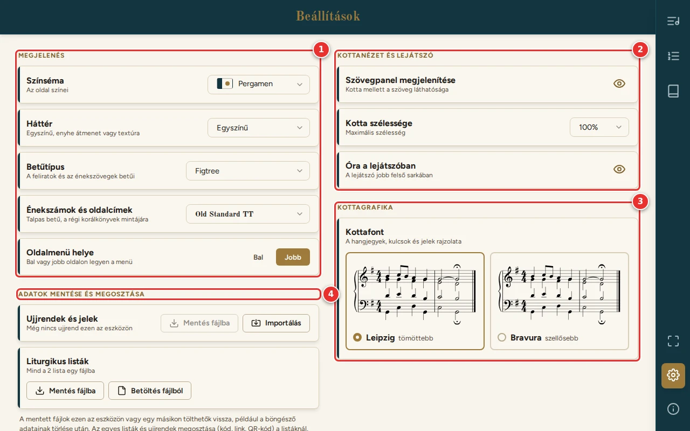
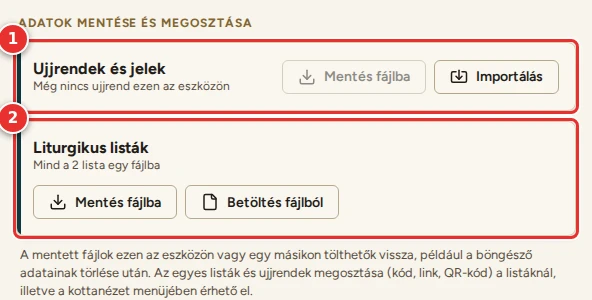

# Beállítások

[← Tartalom](README.md)

Az oldalmenü fogaskerék gombja nyitja meg. Újra megnyomva oda visz vissza, ahonnan jöttél. A beállítások azonnal
érvényesek, és ezen a készüléken megmaradnak.

## 1. Megjelenés

- **Színséma:** Pergamen (alapértelmezett), Papirusz, Sötét papirusz, Törtfehér.
- **Háttér:**
  - Egyszínű;
  - Átmenet – közép (belül kissé sötétebb);
  - Átmenet – szélek (a szélek felé sötétebb);
  - Textúra (papírszemcse, a türkiz elemeken bőrkötés).
- **Betűtípus:** a feliratok és az énekszövegek betűi (Figtree, Nunito Sans, Onest, DM Sans, Atkinson Hyperlegible
  Next). A menüben mindegyik a saját mintájával látszik.
- **Énekszámok és oldalcímek:** talpas betű, a régi korálkönyvek mintájára (Old Standard TT, DM Serif Text, Libre
  Bodoni).
- **Oldalmenü helye:** bal vagy jobb oldalon legyen a menü. Álló telefonon ezen az oldalon van a menügomb, és innen
  jön elő a menü (lásd: [Telefonon](01-elso-lepesek.md#telefonon)).

## 2. Kottanézet és lejátszó

- **Szövegpanel megjelenítése:** a szem ikonnal a kotta melletti szövegpanel elrejthető.
- **Kotta szélessége:** a kotta legnagyobb szélessége (100–50%), ha keskenyebb kottát szeretnél.
- **Óra a lejátszóban:** a pontos idő a lejátszó jobb felső sarkában.

Az oldalsó szövegpanel szélességét nem itt kell beállítani: a panel fogantyújával énekenként állítható (lásd:
[Szövegpanel](04-szovegpanel.md)).

## 3. Kottagrafika

- **Kottafont:** a hangjegyek, kulcsok és jelek rajzolata.
  - **Leipzig:** tömöttebb, alapértelmezett.
  - **Bravura:** szellősebb.
  - Mindkettő ugyanazon a mintakottán látszik, így könnyű összehasonlítani.

## 4. Adatok mentése és megosztása

Itt mentheted fájlba a saját adataidat, és itt töltheted vissza őket. Így biztonsági mentés készíthető, és az adatok
másik eszközre is átvihetők. A mentett fájl a böngésző adatainak törlése után is visszatölthető.

- **Ujjrendek és jelek:** a sorban látszik, hány letéthez és összesen hány hanghoz van ujjrend, pedál- vagy
  játékmódjel ezen az eszközön.
  - **Mentés fájlba:** minden ujjrend és jel egy fájlba (`orgonatar-ujjrendek-<dátum>.json`).
  - **Importálás:** ujjrend betöltése kódból, linkből, fájlból (a mentett `.json` vagy a megosztott `.txt`) vagy
    QR-kódról (lásd: [Ujjrend megosztása](07-megosztas.md#ujjrend-megosztása)). Ugyanannak a letétnek ugyanabban a
    hangnemben lévő ujjrendjét az importált felváltja, a többi megmarad.
- **Liturgikus listák:**
  - **Mentés fájlba:** az összes lista egy fájlba (`orgonatar-listak-<dátum>.json`).
  - **Betöltés fájlból:** a mentett fájl listái a meglévők mellé kerülnek. Előtte egy ablak mutatja, melyik listák
    jönnek. Ami már megvan ezen az eszközön (ugyanilyen nevű és tartalmú lista), az kimarad, így ugyanaz a fájl
    többször is betölthető.

Egy-egy lista a Listák oldalon, egy ének ujjrendje a kotta beállításainak panelén osztható meg (lásd:
[Megosztás és importálás](07-megosztas.md)).

---

[← Megosztás és importálás](07-megosztas.md) · [Tovább: Gyakori kérdések →](09-gyik.md)
