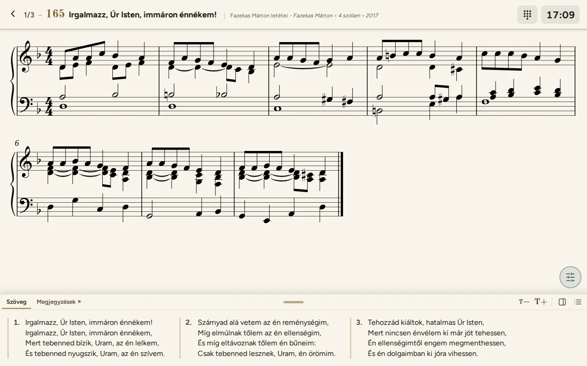

# Református OrgonaTár – használati útmutató

A Református OrgonaTár orgonistáknak készült tabletre, telefonra és számítógépre. Benne van:
- a 2021-es református énekeskönyv énekeinek kottája (letétek és előjátékok) és szövege;
- az istentiszteletre összeállított listák;
- a lejátszó, amelyben a lista énekei egymás után, lapozva jelennek meg.

A program a böngészőben fut, telepíteni nem kell: <https://zseliakiraly.github.io/orgonatar/>. A letöltött
kottakönyvekkel internet nélkül is működik.

## Tartalom

1. [Első lépések](01-elso-lepesek.md) – megnyitás, kezdőképernyő, teljes képernyő, a felület részei, telefonon
2. [Kottakönyvek](02-kottakonyvek.md) – könyvek letöltése, frissítése és elrejtése; internet nélkül
3. [Könyvtár és az ének oldala](03-konyvtar.md) – keresés, kulcsszavak, letét és előjáték, nagyítás
4. [Szövegpanel, megjegyzés, regisztráció](04-szovegpanel.md)
5. [Listák](05-listak.md) – lista összeállítása az istentiszteletre
6. [Lejátszó](06-lejatszo.md) – az istentisztelet alatt: lapozás koppintással vagy pedállal
7. [Megosztás és importálás](07-megosztas.md) – lista átküldése másik eszközre kóddal vagy QR-kóddal
8. [Beállítások](08-beallitasok.md)
9. [Gyakori kérdések](09-gyik.md)
10. [Az adatok karbantartása](10-karbantartas.md) – új könyv, kotta, borítókép, énekleírás feltöltése (a webhely
    gazdájának)

## Röviden: az első istentisztelet

1. A **Kottakönyvek** oldalon töltsd le azokat a könyveket, amelyekből játszani szeretnél.
2. A **Listák** oldalon az **Új lista** gombbal hozz létre egy listát, pl. `2026-10-04 Vasárnapi istentisztelet`.
3. Add hozzá az énekeket. Itt választod ki a letétet, az előjátékot és a versszakokat. Két helyről lehet:
   - a lista szerkesztőjében az **Új ének hozzáadása** gombbal;
   - a **Könyvtárban**, az ének oldalán a **+** gombbal.
4. Az istentiszteleten a lista **Indítás** gombjával nyisd meg a lejátszót. A kotta jobb vagy bal szélére koppintva,
   vagy lapozópedállal lapozhatsz az énekek között.

A képeken a program fekvő tableten látszik (1280 × 800 képpont). Telefonon ugyanígy működik, keskenyebb elrendezésben
([lásd itt](01-elso-lepesek.md#telefonon)).
